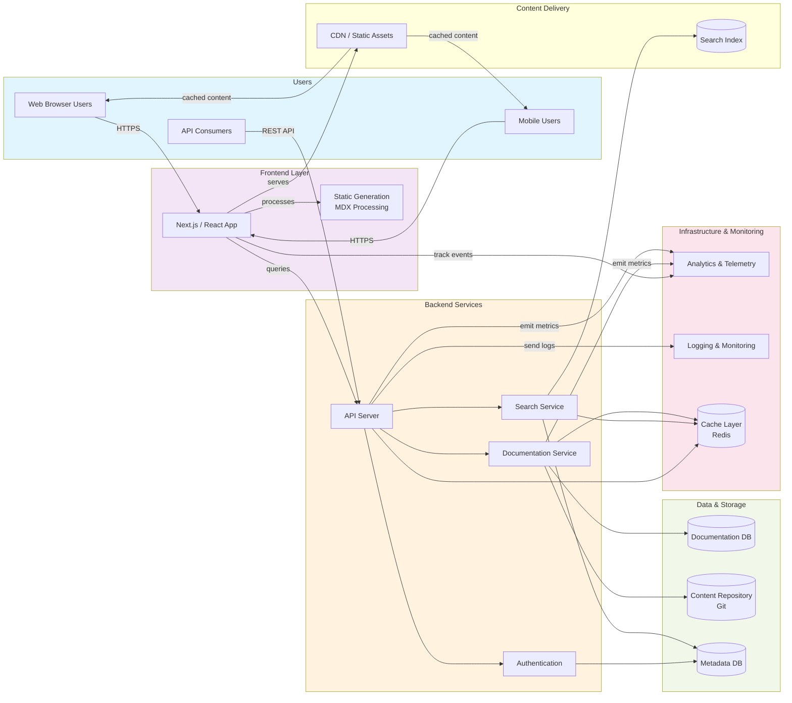

# Architecture Overview

This document provides a visual overview of the EDB Docs system architecture, showing how users interact with the documentation platform, the frontend and backend services, and the supporting infrastructure.

## System Architecture

## Architecture Components

### Users Layer
- **Web Browser Users**: Access documentation through the web interface
- **Mobile Users**: Access documentation on mobile devices via responsive design
- **API Consumers**: Integrate with documentation through REST APIs

### Content Delivery Layer
- **CDN**: Serves static assets and cached content globally
- **Search Index**: Full-text search capability for documentation

### Frontend Layer
- **Next.js / React App**: Modern single-page application for documentation browsing
- **Static Generation**: MDX processing for converting documentation content

### Backend Services
- **API Server**: Main backend service handling requests
- **Documentation Service**: Manages documentation retrieval and processing
- **Search Service**: Provides full-text search functionality
- **Authentication Service**: Handles user authentication and authorization

### Data Layer
- **Documentation DB**: Stores processed documentation metadata
- **Content Repository**: Git-based storage for documentation source files
- **Metadata DB**: Stores user sessions, preferences, and system metadata

### Infrastructure & Monitoring
- **Analytics & Telemetry**: Tracks user behavior and system performance
- **Logging & Monitoring**: Centralized logging for debugging and monitoring
- **Cache Layer**: Redis-based caching for performance optimization

## Key Technologies

- **Frontend**: React, Next.js, MDX (98.3%)
- **Scripting**: JavaScript (1.2%), Shell (0.1%), Python (0.1%)
- **Configuration**: Nunjucks (0.1%)
- **Utilities**: Perl (0.2%)

## Data Flow

1. **Documentation Access**: Users request documentation via Web/Mobile
2. **API Request**: Frontend queries the API server for content
3. **Service Processing**: Documentation and Search services retrieve content
4. **Data Retrieval**: Services query databases and repository
5. **Caching**: Frequently accessed content is cached
6. **CDN Delivery**: Static assets delivered through global CDN
7. **Monitoring**: Metrics and logs collected for analytics

## Deployment Considerations

- Static content is served through CDN for optimal performance
- Documentation is processed at build time when possible
- Search index is maintained and updated regularly
- Caching strategies optimize for frequently accessed content
- Monitoring and analytics inform performance improvements
